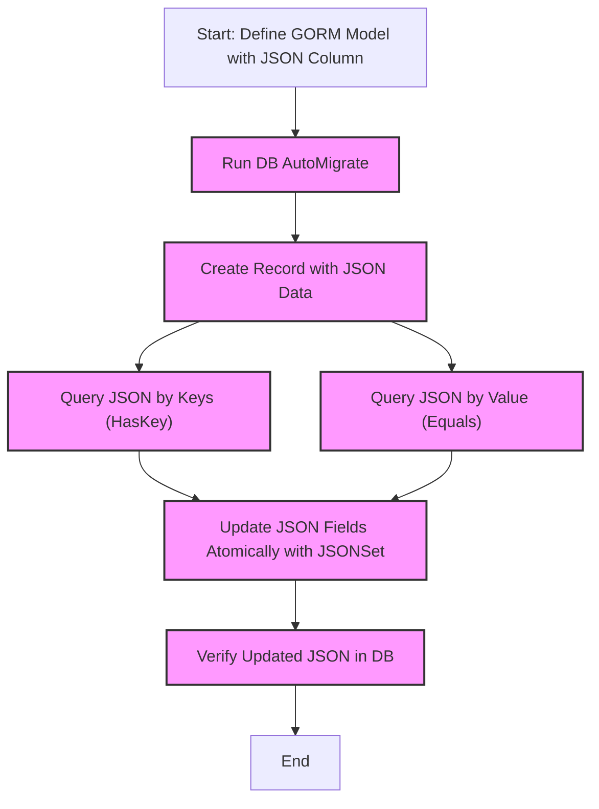

# Using JSON Columns Across Different Databases

Learn how to leverage GORM Data Types to seamlessly store, query, and update JSON columns across SQLite, MySQL, and PostgreSQL databases. This guide walks you through defining JSON columns in your Go models, executing key-based queries, and handling database-specific nuances to ensure robust and efficient JSON data management in your applications.

---

## 1. Workflow Overview

### Task Description
This guide helps you effectively use JSON data columns in GORM models with support for SQLite, MySQL, and PostgreSQL. You'll learn to define JSON fields, perform key presence and value queries, and update JSON content atomically while managing database differences.

### Prerequisites
- Working knowledge of Go and GORM ORM.
- A project with GORM Data Types installed.
- Connection to one of the supported databases: SQLite (with `json1` extension), MySQL, or PostgreSQL.
- Basic understanding of JSON structure.

### Expected Outcome
After completing this guide, you will:
- Define JSON columns in your GORM models.
- Perform key existence (`HasKey`) and value equality (`Equals`) queries on JSON fields.
- Update parts of JSON data atomically using `JSONSet`.
- Handle JSON queries and updates with database-specific syntax abstracted by GORM Data Types.

### Time Estimate
Approximately 15–30 minutes, depending on familiarity with GORM and JSON handling.

### Difficulty Level
Intermediate

---

## 2. Setting Up JSON Columns in Your Models

To start using JSON columns with GORM Data Types, define a model with a `datatypes.JSON` field. Here's a simple example to store user attributes as JSON:

```go
import (
	"gorm.io/datatypes"
	"gorm.io/gorm"
)

type UserWithJSON struct {
	gorm.Model
	Name       string
	Attributes datatypes.JSON
}
```

### Create and Migrate

Ensure the table is created or migrated correctly:

```go
// Drop existing table to start fresh
DB.Migrator().DropTable(&UserWithJSON{})

// AutoMigrate to create the table
err := DB.Migrator().AutoMigrate(&UserWithJSON{})
if err != nil {
	panic(err)
}
```

### Create Records

Insert JSON data as a raw JSON byte slice:

```go
user := UserWithJSON{
	Name: "json-1",
	Attributes: datatypes.JSON([]byte(`{"name":"jinzhu", "age":18, "tags":["tag1", "tag2"], "orgs": {"orga": "orga"}}`)),
}
DB.Create(&user)
```

---

## 3. Querying JSON Columns

GORM Data Types provide expressive query helpers for JSON columns through the `JSONQuery` struct. Use it to query JSON keys and values easily.

### Check for Presence of Keys (`HasKey`)

Retrieve users where the JSON column `Attributes` contains a specific key:

```go
var user UserWithJSON
// Find user where 'role' key exists in 'Attributes'
err := DB.First(&user, datatypes.JSONQuery("attributes").HasKey("role")).Error
if err != nil {
	panic(err) // Handle error as needed
}
fmt.Println(user.Name) // e.g. "json-2"
```

This generates queries like:
- **MySQL / SQLite:** `JSON_EXTRACT(attributes, '$.role') IS NOT NULL`
- **PostgreSQL:** `attributes::jsonb ? 'role'`

### Check Nested Keys
You can specify nested keys as a variadic argument:

```go
// Check nested key 'orgs.orga'
var user UserWithJSON
DB.First(&user, datatypes.JSONQuery("attributes").HasKey("orgs", "orga"))
```

### Check Equality of JSON Values (`Equals`)

Find records where a JSON key equals a value:

```go
// Find user where attributes.name == "jinzhu"
var user UserWithJSON
DB.First(&user, datatypes.JSONQuery("attributes").Equals("jinzhu", "name"))
```

This query compiles to:
- **MySQL / SQLite:** `JSON_EXTRACT(attributes, '$.name') = "jinzhu"`
- **PostgreSQL:** `json_extract_path_text(attributes::json, 'name') = 'jinzhu'`

### Additional JSON Query Options
- **Likes:** Use `.Likes(value, keys...)` for SQL `LIKE` operations on JSON values.
- **Extract:** Use `.Extract(path)` to extract JSON data for use as raw SQL expressions in queries.

---

## 4. Updating JSON Fields Atomically with `JSONSet`

Modify parts of a JSON column without rewriting the entire JSON blob using `JSONSet`. This reduces race conditions and improves performance.

### Define an Update Expression

Use `JSONSet("columnName")` to create an updater, then chain `.Set(path, value)` calls to specify paths and values inside the JSON:

```go
// Update "attributes" column's nested fields atomically
updateExpr := datatypes.JSONSet("attributes").
	Set("age", 20).
	Set("orgs.orga", "orgb").
	Set("tags[0]", "tag3")
```

### Perform the Update

```go
DB.Model(&UserWithJSON{}).Where("name = ?", "json-1").UpdateColumn("attributes", updateExpr)
```

### Notes on Path Syntax
- **MySQL & SQLite:** Use dot notation for nested keys (e.g., `orgs.orga`) and bracket notation for array indices (e.g., `tags[0]`).
- **PostgreSQL:** Use `{key1, key2}` syntax with commas for nested keys (e.g., `{"orgs", "orga"}`) and array indices (e.g., `{tags, 0}`).

### Complex Values
You can also set complex values like structs or arrays; GORM Data Types will marshal them as proper JSON.

```go
friend := UserWithJSON{Name: "Bob", Attributes: datatypes.JSON([]byte(`{"age":21}`))}
DB.Model(&UserWithJSON{}).
	Where("name = ?", "json-1").
	UpdateColumn("attributes", datatypes.JSONSet("attributes").Set("friend", friend))
```

### MariaDB Limitation
MariaDB does not support `CAST(? AS JSON)` so this atomic update feature is limited; in that case, you may want to update the entire JSON or not use `JSONSet`.

---

## 5. Practical Examples

### Example: Create User With Attributes

```go
user := UserWithJSON{
	Name: "json-1",
	Attributes: datatypes.JSON([]byte(`{"age": 18, "name": "json-1", "orgs": {"orga": "orga"}, "tags": ["tag1", "tag2"]}`)),
}
DB.Create(&user)
```

### Example: Query Users With a Specific Key

```go
var users []UserWithJSON
DB.Find(&users, datatypes.JSONQuery("attributes").HasKey("role"))
```

### Example: Query by JSON Key Value

```go
var user UserWithJSON
DB.First(&user, datatypes.JSONQuery("attributes").Equals("json-1", "name"))
```

### Example: Atomic JSON Update

```go
DB.Model(&UserWithJSON{}).
	Where("name = ?", "json-1").
	UpdateColumn("attributes", datatypes.JSONSet("attributes").
		Set("age", 30).
		Set("orgs.orga", "orgc"))
```

---

## 6. Cross-Database Considerations

| Database   | JSON Column Storage Type            | Notes                                        |
|------------|------------------------------------|----------------------------------------------|
| SQLite     | `JSON` (requires json1 extension) | Build with `--tags json1` for JSON querying  |
| MySQL      | `JSON`                             | MariaDB doesn't fully support JSON functions |
| PostgreSQL | `JSONB`                            | Advanced JSONB operations supported           |

### Important Notes
- SQLite requires building with the `json1` extension tag (`go build --tags json1`).
- MySQL supports JSON but MariaDB has limitations on casting in some JSON functions.
- PostgreSQL supports `JSONB`, enabling complex and efficient JSON operations.

---

## 7. Troubleshooting & Best Practices

### Common Issues
- **Unsupported Database Dialect:** Ensure your database is among supported types: SQLite (with json1), MySQL, or PostgreSQL.
- **MariaDB Limitations:** Be aware MariaDB’s JSON support is limited; avoid atomic JSON updates with `JSONSet`.
- **Migration Failures:** Confirm your GORM migrations apply JSON column types correctly, especially in SQLite and PostgreSQL.

### Tips
- Use `datatypes.JSONMap` if you prefer working with map[string]interface{} instead of raw JSON.
- Wrap update logic within transactions if performing multiple JSON mutations.
- Validate JSON keys and paths carefully to avoid query errors.

---

## 8. Next Steps & Related Guides

- [Safely Updating JSON Fields In-Place](../advanced-json-patterns/atomic-json-update) — Deep dive into atomic JSON updates.
- [Strongly-Typed JSON and Array Columns](../advanced-json-patterns/typed-json-slices) — Use generics for JSON data handling.
- [Querying and Filtering JSON Arrays](../advanced-json-patterns/jsonarray-queries) — Learn to query JSON arrays.
- [Prerequisites & System Requirements](/getting-started/setup-basics/prerequisites) — Ensure your environment is configured correctly.
- [Create & Query Data With Advanced Types](/getting-started/first-usage/first-examples) — Hands-on creating and querying with GORM Data Types.

---

## 9. References

- [GORM Data Types GitHub Repository](https://github.com/go-gorm/datatypes)
- Official GORM documentation: https://gorm.io

---

## 10. Visual Workflow Diagram


