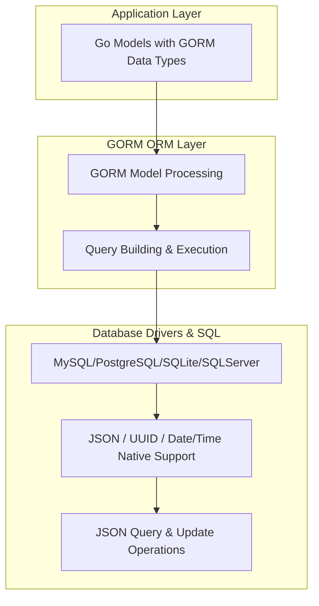

# Integrating GORM Data Types in Full Applications

This guide provides detailed, end-to-end examples that help you embed advanced data types from the GORM Data Types library into practical application workflows. You will learn how to integrate JSON, UUID, Date, and Time data types within your GORM models, exemplified through user profiles, audit logs, and settings management, showcasing how these types fit cleanly within GORM's model system.

---

## Workflow Overview

### Task Description
This guide walks you through integrating GORM Data Types in full Go application models and workflows, enabling you to leverage features like JSON columns, UUID identifiers, and Date/Time fields seamlessly within your GORM-powered apps.

### Prerequisites
- A Go 1.18+ environment with GORM and GORM Data Types installed
- Supported SQL database setup (MySQL, PostgreSQL, SQLite with json1 extension, or SQL Server)
- Basic knowledge of GORM and Go struct modeling

### Expected Outcome
By completing this guide, you will be able to:
- Define models using advanced data types (JSON, UUID, Date, Time)
- Create and query records using these types effectively
- Perform atomic updates on JSON fields
- Ensure your application's models and databases maintain compatibility and data integrity

### Time Estimate
Approximately 20-30 minutes to follow along with the examples and integrate into your project.

### Difficulty Level
Intermediate – familiarity with Go, GORM, and relational databases assumed.

---

## Step-by-Step Integration Examples

### 1. Defining Models with GORM Data Types
Start by embedding GORM Data Types into your Go structs to model richer, strongly typed data.

```go
import (
	"gorm.io/datatypes"
	"gorm.io/gorm"
	"github.com/google/uuid"
)

// UserProfile shows a typical user model embedding JSON, UUID, and Date fields
type UserProfile struct {
	ID        uuid.UUID         `gorm:"type:uuid;default:uuid_generate_v4()"`
	Name      string
	Metadata  datatypes.JSONMap 	// for flexible JSON attributes
	JoinedAt  datatypes.Date    	// stores registration date
	LastLogin datatypes.Time    	// stores time portion of last login
	Settings  datatypes.JSONType[UserSettings]
}

// UserSettings holds strongly-typed settings embedded as JSON
type UserSettings struct {
	Theme       string
	Notifications bool
}
```

<Tip>
Use `datatypes.JSONMap` for flexible key-value JSON data and `datatypes.JSONType[T]` for strongly typed JSON storing known structs.
</Tip>

### 2. Migrating Your Models
Automatically create or update your database tables with these data types.

```go
func migrate(db *gorm.DB) error {
	return db.AutoMigrate(&UserProfile{})
}
```

### 3. Creating Records Including Advanced Types
Populate your models with realistic data reflecting your application’s user contexts.

```go
func createUser(db *gorm.DB) error {
	user := UserProfile{
		ID:       uuid.New(),
		Name:     "Alice",
		Metadata: datatypes.JSONMap{"role": "admin", "tags": []string{"team-lead", "golang"}},
		JoinedAt: datatypes.Date(time.Now()),
		LastLogin: datatypes.NewTime(14, 30, 0, 0),
		Settings: datatypes.NewJSONType(UserSettings{
			Theme:        "dark",
			Notifications: true,
		}),
	}
	return db.Create(&user).Error
}
```

### 4. Querying Records by JSON Content and UUID
Use JSON query helpers and UUID queries to filter data precisely.

```go
func queryUsers(db *gorm.DB) ([]UserProfile, error) {
	var users []UserProfile
	// Find admins based on JSONMap key-value
	if err := db.Where(datatypes.JSONQuery("metadata").Equals("admin", "role")).Find(&users).Error; err != nil {
		return nil, err
	}
	return users, nil
}

func getUserByUUID(db *gorm.DB, id uuid.UUID) (*UserProfile, error) {
	var user UserProfile
	if err := db.First(&user, "id = ?", id).Error; err != nil {
		return nil, err
	}
	return &user, nil
}
```

### 5. Updating JSON Fields Atomically
Leverage the `JSONSet` expression for safe partial updates in JSON columns without overwriting the entire content.

```go
func updateUserSettings(db *gorm.DB, userID uuid.UUID) error {
	jsonSet := datatypes.JSONSet("settings")
	jsonSet = jsonSet.Set("{Theme}", "light")
	jsonSet = jsonSet.Set("{Notifications}", false)
	return db.Model(&UserProfile{}).Where("id = ?", userID).UpdateColumn("settings", jsonSet).Error
}
```

### 6. Handling Date and Time Queries
Precise filtering for records based on date and time types is straightforward.

```go
func findUsersJoinedOn(db *gorm.DB, date datatypes.Date) ([]UserProfile, error) {
	var users []UserProfile
	if err := db.Where("joined_at = ?", date).Find(&users).Error; err != nil {
		return nil, err
	}
	return users, nil
}
```

### 7. Managing Nullable or Optional JSONMap
Models can use pointers to represent nullable JSON columns.

```go
type UserProfileOptional struct {
	ID        uuid.UUID          `gorm:"type:uuid;default:uuid_generate_v4()"`
	Name      string
	Metadata  *datatypes.JSONMap // nullable JSONMap
}
```

---

## Practical Tips & Best Practices

- **Use the right data type for your data's structure:** Use `datatypes.JSONMap` for unstructured JSON data requiring key lookups, and `datatypes.JSONType[T]` for strongly-typed nested structs, which provide type safety in your code.
- **Model UUIDs carefully:** Generate UUIDs using `uuid.New()` or version-specific generators and assign them properly to your model fields with database-friendly SQL types (e.g., `uuid_generate_v4()` in PostgreSQL).
- **Perform atomic JSON updates:** Always use `datatypes.JSONSet` for partial updates to JSON fields to avoid overwriting the entire JSON content and risking data loss in concurrent operations.
- **Index JSON fields where supported:** If your database supports indexing on JSON keys, leverage this to optimize query speed on nested JSON attributes.
- **Beware of database-specific behavior:** Test JSON querying and updates on your production DB to avoid incompatibilities, e.g., MariaDB's JSON casting limits or differences in JSON types syntax between MySQL and PostgreSQL.
- **Migrate with care:** When adding or changing JSON fields, ensure your migration strategy keeps backward compatibility and data integrity as covered in migration best practices.

---

## Common Pitfalls & Troubleshooting

<AccordionGroup title="Common Issues When Integrating GORM Data Types">
<Accordion title="Failed to Migrate Models with JSON Fields">
Ensure your database supports the specific JSON or UUID type used. For PostgreSQL, confirm `uuid-ossp` extension is enabled for UUID generation. Use `AutoMigrate` errors to pinpoint incompatibility.
</Accordion>
<Accordion title="Queries with JSON Attributes Return No Results">
Check your JSON query paths and operators align with your database dialect. Use SQL logging (`db.Logger.LogMode(logger.Info)`) to inspect generated queries. Note that JSON path syntax differs across MySQL (`$.key`) and PostgreSQL (`{key}`) usage.
</Accordion>
<Accordion title="Atomic JSON Updates Fail with MariaDB">
MariaDB does not support `CAST(? AS JSON)` syntax; as a workaround, updates may serialize JSON as strings, resulting in different behavior. Evaluate if MariaDB suits your needs or adjust your update approach.
</Accordion>
</AccordionGroup>

<Tip>
Enable GORM’s debug logger temporarily to observe SQL statements and debug JSON queries or updates effectively.
</Tip>

---

## Realistic Integration Scenario

Imagine implementing a user profile service requiring flexible metadata, strong type safety, and tracking user events. Using GORM Data Types combined:

1. Define the user model with a UUID primary key, JSONMap for metadata (like preferences or tags), and JSONType for detailed settings.
2. Automatically migrate these models.
3. Insert user records capturing both unstructured and strongly typed info.
4. Query users by roles or specific JSON attribute values efficiently.
5. Update user settings atomically to tweak preferences without replacing the entire settings JSON blob.
6. Log audit events with date/time types for precise tracking.


---

## Next Steps & Related Content

- Deepen your JSON handling skills with the [Using JSON Columns Across Different Databases guide](/guides/core-data-types/using-json-columns).
- Learn advanced atomic JSON mutation patterns in [Safely Updating JSON Fields In-Place](/guides/advanced-json-patterns/atomic-json-update).
- Explore typed JSON slices and arrays with the [Strongly-Typed JSON and Array Columns guide](/guides/advanced-json-patterns/typed-json-slices).
- Understand UUID integration fundamentals in [Integrating UUID Fields for Uniqueness](/guides/core-data-types/uuid-integration).
- Master date and time fields for temporal models in [Storing and Querying Date and Time Fields](/guides/core-data-types/working-with-date-time).

---

## Summary Diagram



This architecture illustrates how your advanced Go models interact through GORM, forming queries and updates that translate to native SQL commands leveraging database capabilities for JSON, UUID, and temporal types.

---

<div style="font-size: 0.9em; color: #555;">This guide equips you with practical patterns and code examples to fully embed GORM Data Types in your Go applications, aligning your data models with robust relational database features for modern application needs.</div>
