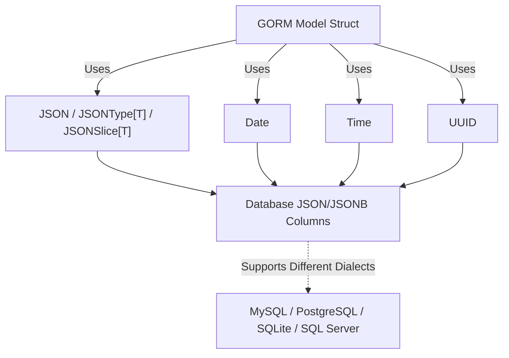

# Core Concepts & Terminology

Welcome to the foundational guide that demystifies the essential terms and concepts powering GORM Data Types. Here, you'll gain clarity on key data types—such as `JSON`, `Date`, `Time`, `UUID`, along with the generic `JSONType[T]` and `JSONSlice[T]`—and understand how they enrich your database modeling experience while ensuring cross-database portability.

---

## Why Understanding These Core Concepts Matters

As a Go developer using GORM, modeling complex and varied data structures directly in your database can be challenging. GORM Data Types extends GORM by providing these advanced types with type-safe operations that work seamlessly across major databases like MySQL, PostgreSQL, SQLite, and SQL Server. This page introduces you to the terminology and roles of each data type, empowering you to model real-world data elegantly and query it efficiently.

Whether you want to embed JSON documents, manage UUID identifiers, or handle precise date/time fields, understanding these core types lays the groundwork for productive and maintainable data-driven applications.

---

## Core Data Types Explained

### JSON
`JSON` in GORM Data Types represents JSON-formatted raw data stored as a `json.RawMessage`. It is supported by SQLite, MySQL, and PostgreSQL (using `JSONB`).

- **Purpose:** Store flexible, hierarchical data structures directly in a single database column.
- **Benefit:** Enables dynamic attributes, metadata, or nested objects without altering schema.
- **Cross-Database Note:** Maps to the optimal JSON storage type per dialect (e.g., MySQL `JSON`, PostgreSQL `JSONB`).

### Date
The `Date` type stores date values with time truncated to the start of the day (00:00:00), enabling precise date representation independent of time.

- **Use Case:** Perfect for birthdays, deadlines, or schedule dates where time details are irrelevant.
- **Behavior:** On retrieval, time is normalized to the beginning of day (UTC).
- **Storage:** Stored in date/time compatible columns depending on the database.

### Time
`Time` represents time-of-day values with optional support for fractional seconds.

- **Applicable DBs:** MySQL, PostgreSQL, SQLite, and SQL Server.
- **Precision:** Supports nanosecond resolution if underlying DB supports it.
- **Typical Usage:** Captures event times, daily schedules, or timestamps without full date context.

### UUID
Universally Unique Identifiers (UUIDs) bring globally unique, 128-bit identifiers into your models, compatible across MySQL, PostgreSQL, SQL Server, and SQLite.

- **Generation:** Supports creating new random UUIDs (version 4).
- **Operations:** Allows comparison (`Equals`), checking for nil or empty UUIDs, and string representation.
- **Benefit:** Avoid collisions and ensure uniqueness for distributed systems or identifiers beyond numeric keys.

### JSONType[T]
`JSONType[T]` is a generic, strongly-typed wrapper around JSON that lets you store and retrieve structured Go types directly as JSON columns.

- **Example:** Define a struct `Attribute` and embed it as `datatypes.JSONType[Attribute]` inside your model.
- **Advantages:** Type safety, clean code, and direct marshaling/unmarshaling without manual JSON handling.
- **Limitations:** Does not support advanced JSON querying.

### JSONSlice[T]
`JSONSlice[T]` facilitates storing JSON arrays of strongly-typed Go structs within a single column.

- **Use Case:** Useful when you want to store lists of tags, options, or nested entities without separate tables.
- **Type-Safe:** Automatically marshals and unmarshals Go slices.
- **Limitations:** Like `JSONType[T]`, it doesn't support JSON querying or some `db.Pluck` operations.

---

## Cross-Database Compatibility: A Seamless Experience

One of GORM Data Types’ core strengths is ensuring your models and queries behave consistently across different SQL databases. Each of these data types maps onto the native types best supported by the underlying database. For example:

- `JSON` maps to `JSON` in MySQL and SQLite; `JSONB` in PostgreSQL.
- `Date` and `Time` fields translate to database-appropriate date/time columns.
- `UUID` uses native UUID types or column formats ensuring correct storage and indexing.

This abstraction ensures you write Go code once without worrying about dialect-specific quirks, streamlining development and reducing bugs.

---

## Practical Scenarios: How These Types Empower You

- **Metadata Storage:** Use `JSON` or `JSONType[T]` to hold user preferences, feature flags, or audit logs evolving independently of schema migrations.

- **Unique Identifiers:** Assign `UUID` for distributed identifiers that remain unique across multiple systems and shards.

- **Scheduling Systems:** Model events with `Date` and `Time` individually to separate day-based logic from time-of-day handling.

- **Complex Lists:** Store arrays of structs, like tags or attributes, using `JSONSlice[T]` for compactness without an extra relational table.

---

## Tips for Success

- **Schema Migration:** Always test migrations across your target databases; GORM automates type mapping but confirm your columns’ types align with your expectations.

- **Querying JSON Fields:** Use supplementing methods and helpers like `JSONQuery` or `JSONSet` (documented elsewhere) for querying and atomic updates.

- **Performance Caution:** Large JSON documents or arrays may affect query performance; index key fields when possible or consider normalization if query speed is critical.

- **Testing:** Leverage test setups with different dialects (MySQL, PostgreSQL, SQLite, SQL Server) to validate behavior.

---

## Next Steps: Expanding Your Mastery
Explore related pages to deepen your understanding and practical ability:

- [Working with JSON Columns Across Different Databases](../guides/core-data-types/using-json-columns)
- [Storing and Querying Date and Time Fields](../guides/core-data-types/working-with-date-time)
- [Integrating UUID Fields for Uniqueness](../guides/core-data-types/uuid-integration)
- [Atomic JSON Updates and Mutation Helpers](../api-reference/advanced-operations/json-update-helpers)

These guides will empower you to fully leverage GORM Data Types for scalable, maintainable database modeling.

---

## Summary Diagram: How Core Data Types Fit Into Your GORM Models

This visual illustrates how your Go struct models leverage these data types to map cleanly onto database columns with dialect compatibility.
