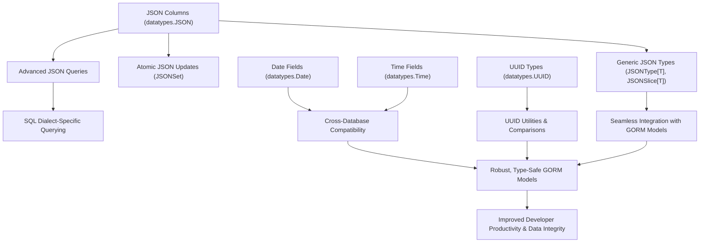

# Feature Highlights

Discover the headline capabilities of **GORM Data Types**, empowering your Go applications with advanced and type-safe SQL data types. This page surveys the most impactful features—from flexible JSON handling and atomic updates to robust support for date/time and UUIDs—providing an at-a-glance sense of what GORM Data Types enables without needing to dive deeply into code.

---

## Unlocking Powerful Data Types for Modern Applications

GORM Data Types extends the GORM ORM with enhanced data modeling capabilities that directly map to sophisticated SQL data types supported by major databases like PostgreSQL, MySQL, SQLite, and SQL Server.

Whether you're working with dynamic JSON fields, unique identifiers with UUIDs, or precise date/time columns, this feature set enables expressive, safe, and efficient CRUD and query operations, all integrated seamlessly into your existing GORM models.

---

## Core Features & Benefits

### 1. Comprehensive JSON Support

- **Flexible JSON Storage**: Store, retrieve, and manipulate JSON data efficiently across supported databases.
- **JSON Columns** (`datatypes.JSON`): Use raw JSON byte arrays for maximum flexibility.
- **Strongly Typed Generics** (`JSONType[T]` & `JSONSlice[T]`): Model JSON data with Go generics for type safety and improved maintainability.
- **Advanced JSON Queries**: Perform key existence checks, equality comparisons, and partial extraction using `JSONQuery` expressions for expressive database queries.
- **Atomic In-Place JSON Updates**: Use `JSONSet` helpers to modify nested JSON fields efficiently without replacing the entire blob — ideal for large, evolving JSON schemas.
- **JSONArray Queries**: Filter rows containing JSON arrays with inner value lookups through `JSONArrayQuery`.

```go
// Define a struct with JSON attributes using JSONType[T]
type Attribute struct {
  Age  int
  Tags []string
}

type User struct {
  gorm.Model
  Name       string
  Attributes datatypes.JSONType[Attribute]
}

// Query example: Find users whose attributes contain tag 'admin'
DB.Where(datatypes.JSONQuery("attributes").HasKey("role")).Find(&users)

// Atomic JSON update example
DB.Model(&User{}).Where("name = ?", "json-1").UpdateColumn("attributes",
  datatypes.JSONSet("attributes").Set("age", 30))
```

---

### 2. Robust Date and Time Handling

- **Date Type** (`datatypes.Date`): Store date-only fields with precision, mapped correctly across databases.
- **Time Type** (`datatypes.Time`): Store time values including optional nanoseconds precision where supported.
- **Cross-Database Compatibility**: Automatic translation to appropriate column types (e.g., `DATE` in MySQL, `TEXT` fallback in SQLite).

```go
// Define a user with a birth date and a time field
 type UserWithTime struct {
    gorm.Model
    Name string
    BirthDate datatypes.Date
    LoginTime datatypes.Time
 }

// Create and query
 user := UserWithTime{Name: "Jane", BirthDate: datatypes.Date(time.Now()), LoginTime: datatypes.NewTime(9, 30, 0, 0)}
 DB.Create(&user)
```

---

### 3. UUID Integration for Unique Identifiers

- **UUID Types** (`datatypes.UUID`, `datatypes.BinUUID`): Seamlessly integrate UUID v4 identifiers.
- **Utility Functions**: Generate new UUIDs, compare UUIDs, and convert UUIDs to strings.
- **Multi-DB Support**: Full compatibility with MySQL, PostgreSQL, SQLite, and SQL Server.

```go
userUUID := datatypes.NewUUIDv4()
user := UserWithUUID{Name: "Alice", UserUUID: userUUID}
DB.Create(&user)

// Query by UUID
var foundUser UserWithUUID
DB.First(&foundUser, "user_uuid = ?", userUUID)

// Compare UUIDs
if user.UserUUID.Equals(foundUser.UserUUID) {
  fmt.Println("UUIDs match")
}
```

---

### 4. Generic Types for Strongly-Typed JSON Modeling

- **`JSONType[T]` and `JSONSlice[T]`**: Define generic, strongly typed JSON fields.
- **Go Generics Advantage**: Type safety, automatic marshaling/unmarshaling, and idiomatic usage in Go 1.18+ applications.
- **Simplified Updates and Queries**: Use with standard GORM APIs for CRUD without losing strong type guarantees.

---

### 5. Advanced Query Building for JSON Data

- **Expressive JSON Queries**: Includes `HasKey()`, `Equals()`, `Likes()` for flexible, targeted searches inside JSON fields.
- **Optimized for Each SQL Dialect**: JSON queries automatically generate SQL matching the underlying database syntax.
- **Supports Complex JSON Paths**: Deeply nested property lookups and array index referencing available.

---

## Practical Examples of Feature Usage

```go
// JSON column with query filter
DB.Find(&users, datatypes.JSONQuery("attributes").HasKey("role"))

// Update nested JSON fields
DB.Model(&User{}).Where("name = ?", "json-1").UpdateColumn("attributes",
  datatypes.JSONSet("attributes").Set("tags[0]", "tag-new"))

// Searching for JSON array elements
DB.Where(datatypes.JSONArrayQuery("config").Contains("admin")).Find(&configs)
```

---

## Summary

GORM Data Types offers a streamlined, powerful toolkit to bring advanced data types like JSON, Date/Time, and UUID into your GORM-managed models. Its generics support combined with specialized query and mutation helpers simplify complex data access requirements. With automatic database compatibility and helpers to perform lightweight, atomic JSON updates, working with complex fields becomes efficient, clean, and reliable.

Explore related pages to dive deeper into setup, syntax, and best practices, or find guides for hands-on examples:

- [Using JSON Columns Across Different Databases](/guides/core-data-types/using-json-columns)
- [Storing and Querying Date and Time Fields](/guides/core-data-types/working-with-date-time)
- [Integrating UUID Fields for Uniqueness](/guides/core-data-types/uuid-integration)
- [Safely Updating JSON Fields In-Place](/guides/advanced-json-patterns/atomic-json-update)

---

## Next Steps

Ready to start? Check out the [Prerequisites & System Requirements](/getting-started/setup-basics/prerequisites) page to prepare your environment, followed by quick start instructions to install and configure GORM Data Types.


---

### Mermaid Diagram: GORM Data Types Feature Highlights Overview



---