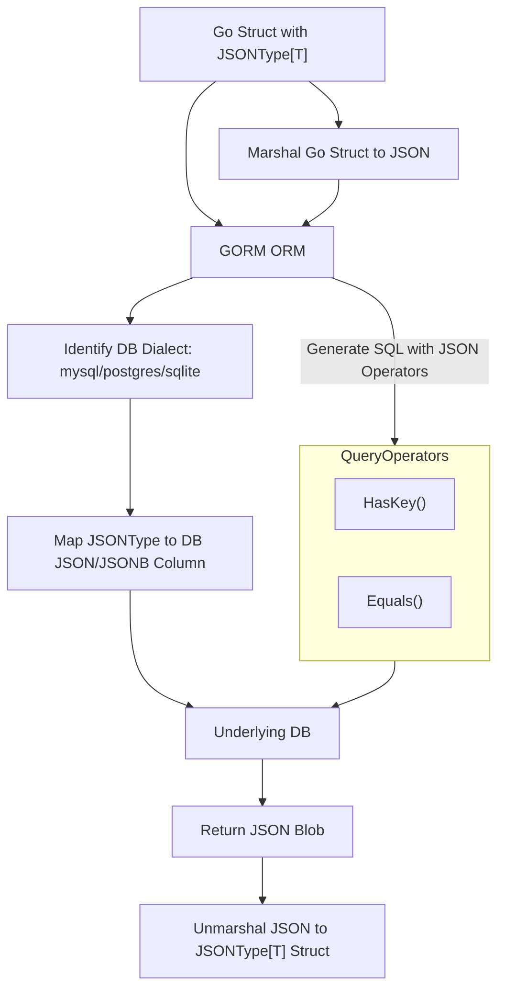

# What is GORM Data Types?

## Unlock Advanced Data Handling in Your GORM Models

GORM Data Types is a powerful Go library extension designed to seamlessly integrate advanced and custom SQL data types into your GORM models. With support for JSON, UUID, date, time, and more across popular databases like MySQL, PostgreSQL, SQLite, and SQL Server, this package expands your database modeling capabilities far beyond the basics.

---

### Why GORM Data Types Matter

Imagine you’re building an application that needs to store complex, nested data like user preferences in JSON, track unique identifiers with UUIDs, or handle precise date-only values without time information. Traditional ORM data types can limit your ability to represent these structures naturally, forcing cumbersome workarounds.

GORM Data Types empowers you to use these rich, custom types directly in your Go structs, maintaining type safety and boosting query expressiveness effortlessly.

---

## What Exactly is GORM Data Types?

At its core, GORM Data Types offers Go types and utilities that extend the standard GORM ORM to support:

- **JSON and JSONB columns** with both dynamic and strongly typed generics
- **UUID handling** with easy generation and comparison
- **Date-only fields** preserving database fidelity
- **Custom SQL type awareness** for each supported dialect

By implementing the necessary database driver interfaces (`driver.Valuer` and `sql.Scanner`), these data types integrate as first-class citizens in GORM workflows — from migrations to queries to updates.

---

## Core Features & Capabilities

### 1. Robust JSON Handling

- **`JSON` and `JSONMap`** for flexible, dynamic JSON storage.
- **Generic `JSONType[T]` and `JSONSlice[T]`** to strongly type JSON data using Go generics — enabling compile-time validation and reducing runtime errors.
- Support for JSON functions like **HasKey**, **Equals**, and **Likes** that translate into optimized DB queries across MySQL, PostgreSQL, and SQLite.
- Utilities for **atomic JSON updates** with `JSONSet`, allowing you to update specific JSON paths inside a column without overwriting the entire data.

```go
import "gorm.io/datatypes"

type UserWithJSON struct {
  gorm.Model
  Name       string
  Attributes datatypes.JSON
}

JSONQuery("attributes").HasKey("role")

// Update age and nested values atomically
DB.Model(&UserWithJSON{}).Where("name = ?", "json-1").UpdateColumn(
  "attributes",
  datatypes.JSONSet("attributes").Set("age", 20).Set("orgs.orga", "orgb"))
```

### 2. Strongly Typed JSON with Generics

Harness Go's type system for safer and clearer data structures.

```go
import "gorm.io/datatypes"

type Attribute struct {
  Sex   int
  Age   int
  Orgs  map[string]string
  Tags  []string
  Admin bool
  Role  string
}

type UserWithTypedJSON struct {
  gorm.Model
  Name       string
  Attributes datatypes.JSONType[Attribute]
}

user := UserWithTypedJSON{
  Name: "hello",
  Attributes: datatypes.NewJSONType(Attribute{
    Age: 18, Sex: 1, Orgs: map[string]string{"orga": "orga"}, Tags: []string{"tag1", "tag2"}, Admin: true,
  }),
}

DB.Create(&user)
```

### 3. UUID Integration

- Type-safe UUID handling using `datatypes.UUID` backed by [google/uuid](https://github.com/google/uuid).
- Supports generation of **UUID v1 and v4** with convenient constructors.
- Database-specific UUID storage types for optimal compatibility.

```go
import "gorm.io/datatypes"

userUUID := datatypes.NewUUIDv4()
user := UserWithUUID{Name: "jinzhu", UserUUID: userUUID}
DB.Create(&user)

// Query by UUID
var result UserWithUUID
DB.First(&result, "user_uuid = ?", userUUID)
```

### 4. Date-Only Type

- Store date fields without time components using `datatypes.Date`.
- Ensures consistency in databases by zeroing time, preserving date semantics.

```go
import "gorm.io/datatypes"

type UserWithDate struct {
  gorm.Model
  Name string
  Date datatypes.Date
}

user := UserWithDate{Name: "jinzhu", Date: datatypes.Date(time.Now())}
DB.Create(&user)
```

### 5. Cross-Database Compatibility

- Smart dialect mapping for each data type ensures **correct SQL column types** are used automatically.
- Supports MySQL, PostgreSQL, SQLite, and SQL Server with dialect-aware logic for JSON and UUID.

---

## Why Should You Care?

Using GORM Data Types means:

- **Expressive Models:** Model complex, nested data naturally.
- **Less Boilerplate:** No manual mapping or custom scanning code.
- **Database Power:** Leverage JSON operators, UUIDs, and date types natively.
- **Increased Stability:** Reduce errors with strong typing and tested implementations.

For instance, with atomic JSON updates, you avoid costly full JSON re-writes and race conditions in concurrent environments.

By integrating UUIDs, you gain globally unique identifiers that aid distributed systems, avoiding collisions and simplifying record references.

---

## Getting Started Preview

### Quick Start

To use these data types, import the package and define your models: 

```go
import "gorm.io/datatypes"

// Define model with advanced data types
```

### Prerequisites

- GORM v2 installed
- Compatible database (MySQL, PostgreSQL, SQLite, SQL Server)
- (Optional) For SQLite JSON features, compile with `json1` tag

### Next Steps

Explore the following documentation to build your first application leveraging GORM Data Types:

- [Create & Query Data With Advanced Types](/getting-started/first-usage/first-examples)
- [Using JSON Columns Across Different Databases](/guides/core-data-types/using-json-columns)
- [Integrating UUID Fields for Uniqueness](/guides/core-data-types/uuid-integration)

---

## Summary Diagram: Data Flow for JSONType Usage



---

## Best Practices & Tips

- Use **strongly typed `JSONType[T]`** when you have fixed JSON schema to gain compile-time safety.
- For flexible or dynamic JSON, `JSON` or `JSONMap` is more appropriate.
- Leverage **`JSONSet`** for efficient partial JSON updates instead of rewriting entire JSON fields.
- Remember dialect differences, especially for JSON paths and casting (`CAST(? AS JSON)` in MySQL but not MariaDB).
- Use **UUIDs** where uniqueness across systems and databases is critical.

## Common Pitfalls

- Forgetting to enable SQLite's `json1` extension can cause JSON queries to fail.
- Using `JSONType[T]` without properly migrating your schema to JSON/JSONB types may cause errors.
- MariaDB's lack of support for `CAST(? AS JSON)` requires alternate update strategies.

---

Harness the full potential of your database capabilities—start modeling with GORM Data Types today.

---

## References

- [GORM Data Types GitHub Repository](https://github.com/go-gorm/datatypes)
- [GORM Official Documentation](https://gorm.io)
- [Google UUID Library](https://github.com/google/uuid)

---

For detailed code examples, migration strategies, and advanced usage patterns, visit related documentation in the guides and API reference sections.